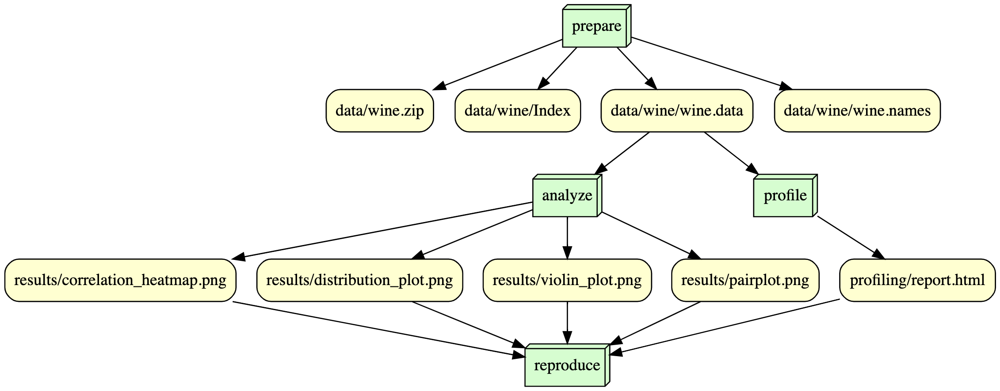

# IS477: Data Management, Curation, and Reproducibility - Final Project
## Overview

The project, is my final project for IS477, Data Curation, Manegement, and Reproducibility at The University of Illinois Urbana-Champaign. The goal of this assignment is to apply all of the techniques and knowledge learned throughout the semester. 

For this assignment, I have selected the University of California Irvine, Wine dataset. 

* This data was obtained via the [University of California Irvine Machine Learning Repository](https://archive.ics.uci.edu/dataset/109/wine)

* Aeberhard, Stefan and Forina, M. (1991). Wine. UCI Machine Learning Repository. https://doi.org/10.24432/C5PC7J

* This dataset is licensed under a Creative Commons Attribution 4.0 International (CC BY 4.0) license. This allows for the sharing and adaptation of the datasets for any purpose, provided that the appropriate credit is given.

* According to the source page, this data contains "the results of a chemical analysis of wines grown in the same region in Italy but derived from three different cultivars. The analysis determined the quantities of 13 constituentsfound in each of the three types of wines."


For my analysis, I have created vizualiations (in png format) of the correlation, distribution of alcohol content in wine, a pairplot, and violin plot of color intesensity. These visualizations may be used to generate insight about the physicochemical feautures of wine and their relationships. In addition, the vizualizations generated may be easily embedded in reports.

## Analysis
 
The analysis.py script generates the following visualization, provding and overview and insight into the dataset and the relationship between the physiochemical properties of wine.

* Correlation_heatmap.png: heatmap of the correlation between the variables in the dataset.
* distribution_plot.png: Distribution of Alcohol content in the wine 
* pairplot.png: Overview of the relationships thate exists among the different variables in the dataset.
* violin_plot.png: Violin plot of color intensity of each wine in the dataset. Showcasing the distribution and density of intensities.


## Workflow


## Reproducing
1. Clone this repository.

Computational Environment in use
```
aisaiah2/is477-fall2023-final-project:v1
```

2. To Reproduce this workflow
```
$ docker run --rm -v ${PWD}:/is477 aisaiah2/is477-fall2023-final-project:v1 snakemake --cores 1 reproduce 
```

This Docker script will execute the following scripts in the <scripts> directory:
* **prepare_data.py**
  *  Your expected output will notify you that the zip file from the URL has been downloaded and extracted. It should also verify the integrity of the file (UCI wine.zip file), stating: "Computed hash matches expected hash". This verifies that the checksums work, i.e. SHA-256 hash values of the files match the expected value.
* **profile.py**
  * This will create 'report.html' which profiles the UCI wine dataset.
* **analysis.py**
  * This script willconduct pre-set analysis and create vizualizations of the data.

3. Clean 
```
$ docker run --rm -v ${PWD}:/is477 aisaiah2/is477-fall2023-final-project:v1 snakemake --cores 1 reproduce --delete-all-output
```
* This script will clear all of the output files and allow you reproduce the project.

## Licenses
### Software License
This project is licensed under the terms of the MIT license

The MIT License is a permissive open-source software license that allows users the freedom to use, modify, and distribute the software without significant restrictions. It grants broad permissions, including the right to sublicense and sell copies of the software, while requiring users to include the original copyright notice and the license text in any substantial portion of the software. 

The license includes a disclaimer of warranty, stating that the software is provided "as is" without any guarantee. Additionally, it absolves the authors or copyright holders from liability, making it clear that they will not be held accountable for any claims or damages arising from the use of the software. Known for its simplicity and compatibility with other licenses, the MIT License is widely adopted in the open-source community.

### Data License

The wine dataset, used in this project, is licensed under a Creative Commons Attribution 4.0 International (CC BY 4.0) license. This allows for the sharing and adaptation of the datasets for any purpose, provided that the appropriate credit is given." Therefore any data created from this project will also be licensed under a Creative Commons Attribution 4.0 International (CC BY 4.0) license.

## References

*  Aeberhard, Stefan and Forina, M. (1991). Wine. UCI Machine Learning Repository. https://doi.org/10.24432/C5PC7J

* Forina, M. et al (1988) “PARVUS - An Extendible Package for Data Exploration, Classification and Correlation.” Institute of Pharmaceutical and Food Analysis and Technologies, Via Brigata Salerno, 16147 Genoa, Italy.

## Folder Structure
```
├── Dockerfile
├── LICENSE
├── README.md
├── data
│   ├── wine
│   │   ├── Index
│   │   ├── wine.data
│   │   └── wine.names
│   └── wine.zip
├── profiling
│   └── report.html
├── requirements.txt
├── results
│   ├── correlation_heatmap.png
│   ├── distribution_plot.png
│   ├── pairplot.png
│   └── violin_plot.png
├── scripts
│   ├── __pycache__
│   │   └── profile.cpython-39.pyc
│   ├── analysis.py
│   ├── dag.py
│   ├── prepare_data.py
│   └── profile.py
├── snakefile
├── workflow
│   └── workflow.png
└── zenodo.json
```